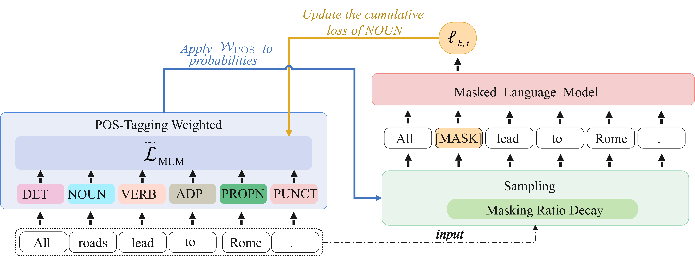

<!-- <p align="center">

</p> -->

<!-- [[中文版](README.md)]
 -->
 <p align="center">
  <a href="https://aclanthology.org/2023.acl-long.400.pdf"><b>[Paper] Learning Better Masking for Better Language Model Pre-training</b></a>
  </br>
  <b>ACL 2023 </b>
</p>

---

<p style="text-align:justify; text-justify:inter-ideograph;">
Masked Language Modeling (MLM) has been widely used as the denoising objective in pre-training language models (PrLMs). Existing PrLMs commonly adopt a Random-Token Masking strategy where a fixed masking ratio is applied and different contents are masked by an equal probability throughout the entire training. However, the model may receive a complicated impact from pre-training status, which changes accordingly as training time goes on. In this paper, we show that such time-invariant MLM settings on masking ratio and masked content are unlikely to deliver an optimal outcome, which motivates us to explore the influence of time-variant MLM settings. We propose two scheduled masking approaches that adaptively tune the masking ratio and masked content in different training stages, which improves the pre-training efficiency and effectiveness verified on the downstream tasks. Our work is a pioneer study on time-variant masking strategy on ratio and content and gives a better understanding of how masking ratio and masked content influence the MLM pre-training
</p>

<!-- ### News
--- -->

## Proposed Method
<p align="center">

</p>
#### Masking Ratio Decay
We design an optimized Masking Ratio Decay (MRD) schedule. At the beginning of pre-training, we use a high masking ratio and decay the masking ratio using certain strategies, which is similar to learning rate decay without warmup. Assuming that the model generally adopts a fixed masking ratio p% for training, we use a very high masking ratio (about 2p%) as the starting point and a very low masking ratio (nearly zero) as the ending point in MRD.


#### Pos-Tagging Weighted Masking
We present the POS-Tagging Weighted (PTW) Masking, making the models have more chance to train on the difficult words according to the current training state.

- Step 1: Pos-tagging pre-processing
- Step 2: Calculating cumulative losses of different types of words
- Step 3: Calculating the weighted probabilities for sampling masked tokens according to the cumulative losses


## Pre-training
#### Running Masking Ratio Decay
```
pip install requirements.txt
python -m spacy download en_core_web_lg
python -m torch.distributed.launch --nproc_per_node=8 bert_mrd_pretrain.py \
    --steps 200000 \
    --base_run_name bert_mrd \
    --ckpt_output_dir ./checkpoints \
    --dsets_cache_dir ./datasets \
    --size large \
    --datas wikipedia \
    --masking_mode cosine
```
- `base_run_name`: `str`, is the run name of wandb.
- `masking_mode`: `str`, adjust the MRD strategies, e.g., cosine or linear.


#### Running PTW Masking
```
pip install requirements.txt
python -m spacy download en_core_web_lg
python -m torch.distributed.launch --nproc_per_node=8 bert_ptw_pretrain.py \
    --steps 200000 \
    --base_run_name bert_ptw \
    --ckpt_output_dir ./checkpoints \
    --dsets_cache_dir ./datasets \
    --size large \
    --datas wikipedia \
    --probe \
    --pos_wt
```
- `probe`: `bool`, records the cumulative losses of different pos tags.
- `pos_wt`: `bool`, uses the cumulative losses to adaptively ajust the masking ratios of the words with different ratios.


## Citation

If your work take inspiration from or make use of our method or data, we kindly request that you acknowledge and cite our paper as a reference.


```bibtex
@misc{yang2023learning,
      title={Learning Better Masking for Better Language Model Pre-training}, 
      author={Dongjie Yang and Zhuosheng Zhang and Hai Zhao},
      year={2023},
      eprint={2208.10806},
      archivePrefix={arXiv},
      primaryClass={cs.CL}
}
```


